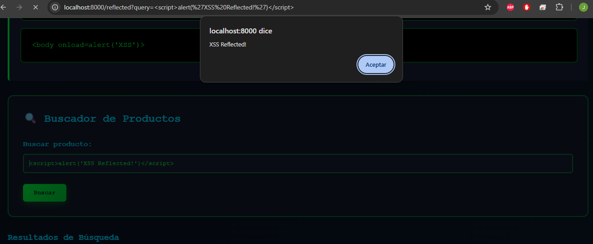

# Laboratorio XSS - Análisis de Vulnerabilidades

## Información del Equipo
- **Integrante 1:** Juan David Jiménez López - @JuandJz
- **Fecha:** 2025-11-27


# Documentación del Proceso – Laboratorio XSS

## 1. Clonación del Repositorio

Primero cloné mi repositorio personal del laboratorio:

```bash
git clone https://github.com/JuandJz/cross-site-scripting-xss-lab.git
```

Esto descargó todos los archivos necesarios para el laboratorio XSS.

## 2. Creación de la Rama de Trabajo

Para hacer modificaciones sin afectar la rama principal, creé una nueva rama:

```bash
git checkout -b feature-readme
```

## 3. Problema Inicial – Git no tenía configurado mi nombre ni mi correo

Cuando intenté hacer commit:

```bash
git commit -m "Agregar información del equipo al README"
```

Git respondió:

```
Author identity unknown
fatal: unable to auto-detect email address
```

Causa: Git necesita saber quién hace los commits.

Solución: Configuré mis datos globalmente:

```bash
git config --global user.name "Juan David Jiménez López"
git config --global user.email "feliwinllopsan@gmail.com"
```

Después de esto, Git aceptó el commit.

## 4. Edición del README

Agregué mi información personal:

- Nombre
- Usuario de GitHub
- Fecha de entrega

Luego ejecuté:

```bash
git add README.md
git commit -m "Agregar información del equipo al README"
git push -u origin feature-readme
```

La rama se subió correctamente a GitHub.

## 5. Creación de Entorno Virtual (venv)

Para trabajar el laboratorio de forma aislada:

```bash
python -m venv venv
```

Activación del entorno virtual en Git Bash (Windows):

```bash
source venv/Scripts/activate
```

Apareció el prefijo `(venv)` indicando que estaba activo.

## 6. Instalación de Dependencias

Instalé los paquetes necesarios:

```bash
pip install -r requirements.txt
```

La instalación terminó sin errores.

## 7. Inicialización de la Base de Datos

Ejecuté:

```bash
python database.py
```

Salida del sistema:

```
Base de datos inicializada correctamente
Usuarios de prueba creados correctamente
Comentarios de prueba cargados correctamente
```

## 8. Ejecución del Servidor

Para iniciar el laboratorio:

```bash
python main.py
```

Salida:

```
Base de datos inicializada correctamente

    ╔═══════════════════════════════════════════════════════════╗
    ║  🔍 LABORATORIO XSS - SISTEMA VULNERABLE                  ║
    ║                                                           ║
    ║  ⚠️  ADVERTENCIA: Aplicación intencionalmente vulnerable  ║
    ║     Solo para uso educativo                               ║
    ║                                                           ║
    ║  🌐 Servidor iniciando en: http://localhost:8000         ║
    ╚═══════════════════════════════════════════════════════════╝

INFO:     Started server process
INFO:     Waiting for application startup.
INFO:     Application startup complete.
INFO:     Uvicorn running on http://0.0.0.0:8000
INFO:     127.0.0.1 - "GET / HTTP/1.1" 200 OK
```

El laboratorio se ejecutó correctamente en:

http://localhost:8000

# 🔍 Laboratorio XSS - Sistema Educativo Vulnerable


## 🧪 Ejercicio 1 — Reflected XSS (Búsqueda Vulnerable)

En este ejercicio se explora una vulnerabilidad de tipo **Reflected XSS**, presente en el buscador del sistema.  
La entrada del usuario se refleja directamente en la página sin aplicar ningún escape HTML.

---

##  Payloads probados

A continuación se muestran los payloads utilizados y sus respectivos resultados.

---

###  1. Payload principal — Popup exitoso

**Payload:**

```html
<script>alert('XSS Reflected!')</script>

##  Las imagenes se encuentran en la carpeta imgpruebasXSS ya que no supe como referenciarlas en el readme

 
Payload alternativo: etiqueta  con onerror

Payload:


<svg onload=alert('XSS')>
<body onload=alert('XSS')>

Resultado: Ejercicio exitoso.

## ⚠️ ADVERTENCIA IMPORTANTE

**Este laboratorio es INTENCIONALMENTE VULNERABLE y está diseñado EXCLUSIVAMENTE para fines educativos.**

- ❌ **NO** usar en producción
- ❌ **NO** exponer a internet público
- ❌ **NO** usar con datos reales o sensibles
- ❌ **NO** aplicar estas técnicas en sistemas sin autorización
- ✅ **SÍ** usar solo en entornos de aprendizaje controlados

## 📚 Descripción

Sistema educativo completo para aprender sobre vulnerabilidades **Cross-Site Scripting (XSS)** mediante práctica hands-on. Incluye cuatro ejercicios progresivos que cubren los tipos principales de XSS y técnicas de bypass.

### Ejercicios Incluidos

1. **🔄 Reflected XSS** - XSS que se refleja inmediatamente en la respuesta
2. **💾 Stored XSS** - XSS persistente almacenado en la base de datos
3. **🌐 DOM-based XSS** - Vulnerabilidades en JavaScript del cliente
4. **🔓 Bypass de Filtros** - Evasión de filtros de seguridad básicos

## 🎯 Objetivos de Aprendizaje

- Entender cómo funcionan los ataques XSS
- Identificar código vulnerable en aplicaciones web
- Practicar técnicas de explotación en un entorno seguro
- Aprender las mejores prácticas de defensa contra XSS
- Desarrollar mentalidad de seguridad ofensiva y defensiva

## 🚀 Instalación

### Requisitos Previos

- Python 3.8 o superior
- pip (gestor de paquetes de Python)
- Navegador web moderno (Chrome, Firefox, Edge)

### Pasos de Instalación

```bash
# 1. Clonar o descargar el repositorio
cd xss-injection-lab

# 2. (Opcional pero recomendado) Crear entorno virtual
python -m venv venv

# Activar en Windows:
venv\Scripts\activate

# Activar en Linux/Mac:
source venv/bin/activate

# 3. Instalar dependencias
pip install -r requirements.txt

# 4. Inicializar base de datos (automático al iniciar)
python database.py

# 5. Ejecutar el servidor
python main.py
```

### Acceso

Una vez iniciado el servidor, abre tu navegador y visita:

```
http://localhost:8000
```

## 📖 Guía de Uso

### Para Estudiantes

1. **Comienza con el Ejercicio 1 (Reflected XSS)**
   - Lee las instrucciones y explicaciones técnicas
   - Prueba los payloads sugeridos
   - Experimenta con variaciones

2. **Progresa a ejercicios más complejos**
   - Cada ejercicio introduce nuevos conceptos
   - Usa las herramientas de desarrollador (F12)
   - Observa los mensajes en la consola del navegador

3. **Explora la página de Usuarios**
   - Entiende qué datos pueden ser robados con XSS
   - Visualiza el impacto de un ataque exitoso


## 🎓 Estructura del Proyecto

```
xss-injection-lab/
├── main.py                 # Aplicación FastAPI principal
├── database.py             # Configuración de BD y datos de prueba
├── requirements.txt        # Dependencias Python
├── README.md              # Este archivo
├── .gitignore             # Archivos a ignorar en Git
├── templates/             # Templates HTML Jinja2
│   ├── index.html        # Página principal
│   ├── reflected.html    # Ejercicio 1: Reflected XSS
│   ├── stored.html       # Ejercicio 2: Stored XSS
│   ├── dom.html          # Ejercicio 3: DOM-based XSS
│   ├── bypass.html       # Ejercicio 4: Bypass de filtros
│   ├── users.html        # Datos de usuarios de prueba
│   └── about.html        # Información del laboratorio
└── static/
    └── style.css         # Estilos CSS (tema hacker)
```

## 💡 Ejemplos de Payloads

### Reflected XSS
```html
<script>alert('XSS')</script>

<svg onload=alert('XSS')>
```

### Stored XSS
```html
<script>alert('Stored XSS')</script>

<iframe src="javascript:alert('XSS')">
```

### DOM-based XSS
```
?name=
#<svg onload=alert('Fragment XSS')>
```

### Bypass de Filtros
```html
<ScRiPt>alert('Bypass')</ScRiPt>

<svg/onload=alert('Bypass')>
```

## 🛡️ Conceptos de Defensa Enseñados

- **Escape HTML**: Convertir `< > " ' &` en entidades HTML
- **Content Security Policy (CSP)**: Headers de seguridad restrictivos
- **HTTPOnly Cookies**: Prevenir acceso desde JavaScript
- **Input Validation**: Validar formato y tipo de datos
- **Output Encoding**: Codificar según contexto (HTML, JS, URL)
- **Sanitización**: Usar bibliotecas como DOMPurify
- **Trusted Types API**: API del navegador para prevenir XSS

## 🔧 Configuraciones Vulnerables Intencionales

Este laboratorio incluye las siguientes configuraciones inseguras **por diseño**:

```python
# 1. Autoescape deshabilitado en Jinja2
templates.env.autoescape = False

# 2. Headers de seguridad deshabilitados
X-XSS-Protection: 0
X-Frame-Options: ALLOW

# 3. Sin Content Security Policy
# (No hay CSP configurado)

# 4. Sin validación de entrada
# Los inputs se aceptan tal cual

# 5. Sin sanitización de output
# Los datos se muestran sin escape
```

## 📊 Datos de Prueba

### Usuarios Predeterminados

| Usuario | Email | Contraseña | Rol |
|---------|-------|-----------|-----|
| admin | admin@xsslab.com | Admin123! | Administrador |
| jperez | juan.perez@empresa.com | JuanP2024 | Usuario |
| mgarcia | maria.garcia@empresa.com | MariaG2024 | Usuario |

### Comentarios Iniciales

El sistema incluye 3 comentarios de prueba que se pueden limpiar y regenerar.

## 🐛 Solución de Problemas

### El servidor no inicia

```bash
# Verifica que Python esté instalado
python --version

# Verifica que las dependencias estén instaladas
pip list

# Reinstala las dependencias
pip install -r requirements.txt --force-reinstall
```

### Los XSS no se ejecutan

- Verifica que estés usando un navegador moderno
- Algunos navegadores tienen protecciones XSS integradas (desactívalas para este lab)
- Revisa la consola del navegador (F12) para errores
- Asegúrate de que el payload esté correctamente formateado

### Error de base de datos

```bash
# Elimina la base de datos y déjala regenerar
rm xss_lab.db
python main.py
```

## 📚 Recursos Adicionales

### Documentación Recomendada

- [OWASP XSS Prevention Cheat Sheet](https://cheatsheetseries.owasp.org/cheatsheets/Cross_Site_Scripting_Prevention_Cheat_Sheet.html)
- [PortSwigger XSS Guide](https://portswigger.net/web-security/cross-site-scripting)
- [MDN Web Security](https://developer.mozilla.org/en-US/docs/Web/Security)

### Plataformas de Práctica Legal

- [HackTheBox](https://www.hackthebox.com/)
- [TryHackMe](https://tryhackme.com/)
- [PortSwigger Web Security Academy](https://portswigger.net/web-security)
- [OWASP WebGoat](https://owasp.org/www-project-webgoat/)

## 🤝 Hacking Ético

### Reglas Importantes

1. ✅ **Obtén permiso explícito** antes de probar seguridad en cualquier sistema
2. ✅ **Usa solo entornos autorizados** como este laboratorio
3. ✅ **Reporta vulnerabilidades responsablemente** si las encuentras
4. ✅ **Respeta la ley** - El hacking no autorizado es ilegal
5. ✅ **Aprende para defender** - El objetivo es proteger, no atacar

## ⚖️ Consideraciones Legales

El uso indebido de técnicas de hacking es ilegal en prácticamente todas las jurisdicciones. Este laboratorio es para educación y debe usarse solo con:

- Sistemas de tu propiedad
- Sistemas para los que tienes permiso explícito por escrito
- Entornos de laboratorio diseñados para práctica

**Las consecuencias del hacking ilegal pueden incluir:**
- Cargos criminales
- Multas significativas
- Tiempo en prisión
- Antecedentes penales

## 📝 Licencia

Este proyecto es de código abierto y está disponible únicamente para **fines educativos**. No se proporciona garantía alguna. El uso de este software es bajo tu propio riesgo.

## 🙏 Créditos

Desarrollado como material educativo para cursos de Ciberseguridad en Ingeniería de Sistemas.

**Tecnologías utilizadas:**
- FastAPI - Framework web
- Python - Lenguaje de programación
- SQLite - Base de datos
- Jinja2 - Motor de templates
- HTML/CSS/JavaScript - Frontend

---

## ⚠️ Recordatorio Final

**ESTE ES UN SISTEMA INTENCIONALMENTE VULNERABLE. NO LO USES EN PRODUCCIÓN.**

Si tienes preguntas o encuentras problemas, consulta con tu instructor o revisa la documentación.

¡Feliz aprendizaje y hackeo ético! 🔒
